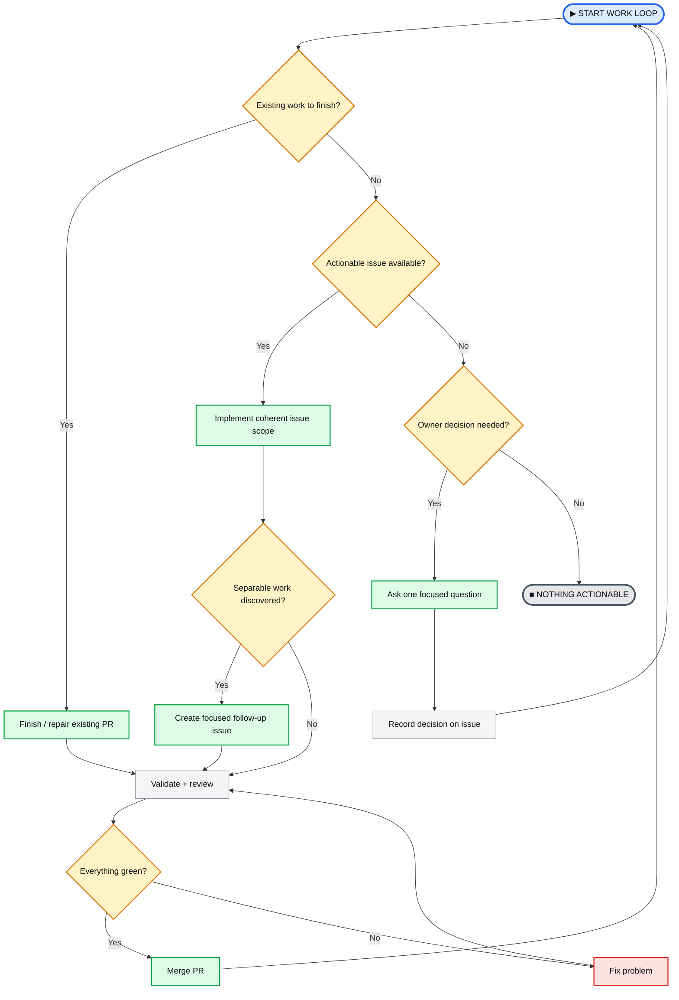

# dotfiles

Personal development-environment and reusable coding preferences.

## What belongs here

This repository stores portable defaults that are useful across projects. Repository-local configuration and pinned conventions remain authoritative when a project needs different behavior.

Keep secrets, credentials, machine-specific paths, and Git identity out of the repository.

## Home-level defaults

- `.gitconfig` — fast-forward-only pulls, pruned fetches, automatic upstream setup, rerere, zdiff3 conflicts, histogram diffs, autostash for explicit rebases, and review-friendly commit/status defaults.
- `.config/git/ignore` — only OS/editor trash. Semantic project ignores such as `.env` remain owned by each repository.
- `.editorconfig` — LF line endings, final newlines, two-space defaults, 100-column guidance, and Rust/Makefile overrides.

On Linux or WSL, preview the home links with:

```sh
node scripts/link-home.mjs --dry-run
```

Apply them with:

```sh
node scripts/link-home.mjs
```

The linker is intentionally non-destructive: it refuses to replace an existing file or unrelated symlink.

## Project coding preferences

- `.oxfmtrc.json` — Oxfmt formatting defaults with deterministic import sorting.
- `.oxlintrc.json` — Oxlint correctness, suspicious-code, performance, TypeScript, control-flow, and import rules.
- `eslint.config.mjs` — dependency-free ESLint flat-config baseline for JavaScript projects that still need ESLint-specific integrations.

Copy or symlink these into a project when appropriate, then keep project-specific additions in that project. Do not make a project depend on this repository at runtime.

## Coding-agent workflow

All coding-agent work runs through one global loop over GitHub issues:

- `skills/work-loop` — scan open issues across the repositories, pick an actionable one, work in its repository by that repository's `AGENTS.md`, validate, update GitHub, repeat. A dependency on another repository becomes an issue there.
- `skills/unblock` — when nothing is actionable, ask the owner about `needs-decision` issues one question at a time and record each answer on the issue.

GitHub issues and pull requests are the only work state. Repositories keep their own instructions, conventions, tests and architecture; they do not define their own agent loops, claims, queues or status labels.


### Work-loop mental model

The skill file is the operational definition; this diagram is the human-readable control flow. A current issue should produce one coherent PR. If implementation reveals additional work that can be separated cleanly, create focused follow-up issues rather than expanding the PR indefinitely.



Install the skills for Claude Code and Codex by symlinking them:

```bash
mkdir -p ~/.claude/skills ~/.agents/skills
for s in skills/*/; do
  ln -sfn "$PWD/$s" ~/.claude/skills/"$(basename "$s")"
  ln -sfn "$PWD/$s" ~/.agents/skills/"$(basename "$s")"
done
```

## VS Code

- `.vscode/settings.json` — save-time Oxfmt then Oxlint fixes, focused navigation/refactoring aids, explicit Git synchronization behavior, compact editor presentation, and Rust/TOML formatting.
- `.vscode/extensions.json` — Oxc, ESLint, EditorConfig, Rust Analyzer, TOML, WSL, and Dev Container recommendations.

The VS Code files are reusable workspace defaults. User-settings locations differ between Windows-hosted VS Code, WSL, and native Linux, so they are not linked automatically.

## Validation

Run:

```sh
node scripts/check.mjs
```

The check parses all JSON configuration, validates the Git config, syntax-checks the ESLint module, and runs `git diff --check` over unstaged and staged changes.

## Convention policy

This repository currently does not pin `coding-agent-conventions`. Agents should use the published machine-readable shared conventions as fallback policy without silently installing or updating them.
